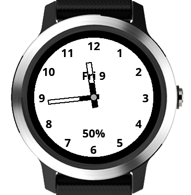

# Battery-saving Analog Watch Face (BAWF)



This is an extremely simple, non-configurable, watch face for the
Garmin Vivoactive 3. It may work on other Garmin products with round faces,
but this hasn't been tested [edited to add: it works fine with the
Vivoactive 4 as well. However, this device, and others with large
storage capacity, use MTP rather than USB mass storage to transfer
files. This doesn't affect the use of this watch face, but it might
potentially affect how you transfer the .prg file to the watch].

The sole purpose of this application is to present an Analog watch
face with the minimum amount of power consumption, to extend battery life.
To that end there is no seconds hand, no dynamically-generated
fitness information, nothing except time and date. I've been very
careful to ensure that the amount of math required to draw the face
is minimized, and repeated calculation avoided.

Thirty-party watch faces for Garmin fitness products are frequently 
blamed for causing battery drain. It's very easy to implement a watch
face carelessly, so that it does too much work, too often. Anything that
displays a second hand will need to redraw at least part of the screen
every second. This watch face is generally updated only once per minute.

## Building

If you're reading this, you probably already know who to build 
ConnectIQ watch face apps. I build at the command line like this:

```
monkeyc -o bawf.prg -y /path/to/my/certificate.der -f ./monkey.jungle -d vivoactive3
```

To run on the simulator:

```
monkeydo bawf.prg vivoactive3
```

# Installing

To install on a watch, just copy bawf.prg to the `/GARMIN/APPS/` directory
when the watch is mounted as a USB drive.


